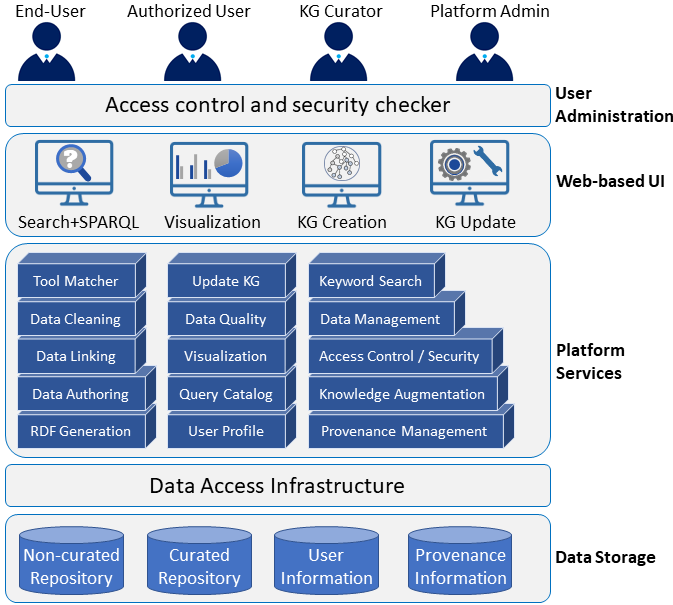
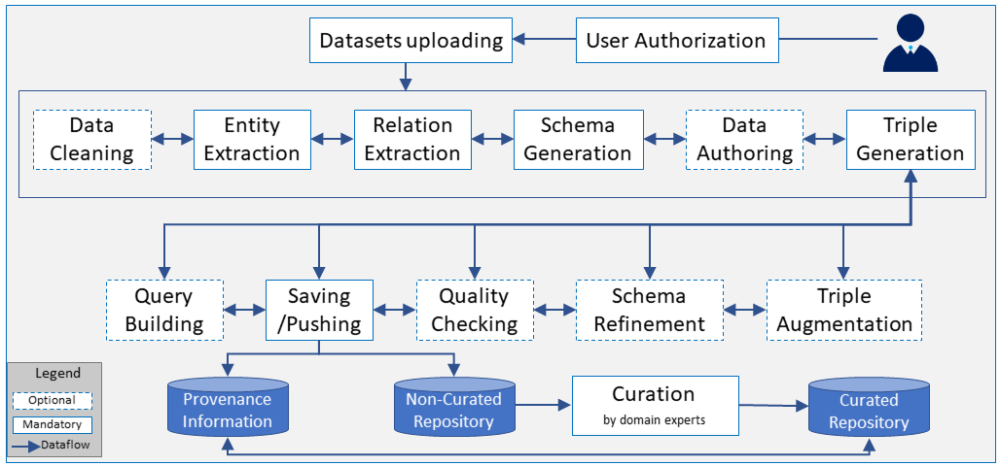

Welcome to the website of the **iKNOW** poster @[ISWC_2022](https://iswc2022.semanticweb.org/)! 

# **iKNOW- A Knowledge Graph Management Platform for the Biodiversity Domain**
 

### We aim to to build a semantic-based toolbox for KG generation in the biodiversity domain.
  
 
The iKNOW project is a joined effort by computer scientists and domain experts from the German Centre for Integrative Biodiversity Research [iDiv](www.idiv.de).

 
iKNOW focuses on the (semi-)automatic, reproducible transformation of tabular biodiversity data into RDF statements. It also includes provenance tracking to ensure reproducibility and update ability. Further, options for visualization, search, and query are planned.
Once established, this platform will be open-source and available to the biodiversity community. Thus, it can significantly contribute to making biodiversity data widely available, easily discoverable, and integrable.

## iKNOW Architecture

The following Figure shows the planned architecture of iKNOW in five layers:

- In the **User Administration** layer, access level and security will be controlled. Authorized users can generate or update the KG. All end-users can search and visualize the KG. The platform's admin can add new tools or functionalities and approve the user registration. The KG curator curates the recent changes on the KG. 
- The **Web-based UI** layer shows different scenarios for KG management: building a KG, updating the KG, visualizing the KG's triples, and keyword and SPARQL search.
- The **Platform Services** provides a set of required services for the KG management functionalities. 
- The **Data Access Infrastructure** manages the communication of services and data storage.
- At the bottom level of the iKNOW platform, the **Data Storage** layer contains the graph database repository, provenance information, and user information management.
 
 

  
  
  
  
## Workflow in the KG Creation Scenario at iKNOW
The following Figure shows the planned iKNOW workflow for the KG creation scenario.

- In the first step, users go through the authentication process. The verified users can upload their datasets. 
- If required, the **Data Cleaning** process will take place. We offer different tools for this step, which users can select and adjust based on their needs. 
- In the **Entity Extraction** step, we map the entities of the dataset to the corresponding concepts in the real world (which build instances of sub-KGs). This mapping is the basis for interlinking entities  with  external KGs like Wikidata or domain-specific ones. Each mapped entity is a node in the KG. For this process, we have embedded different tools at iKNOW, in which users can select the desired tool along with the desired external KGs.
- In the **Relation Extraction** step, the relations between the KG's nodes will be extracted via the user-selected tool. 
- Through our GUI, the user can edit them (**Data Authoring** step).
- Each column from the relational dataset refers to a category in the world. We consider the types of the column as classes in the KG. Along with the extracted relations in the previous step, the schema of this sub-KG will be created in the **Schema Generation** step.
- In the **Triple Generation** step, (subject, predicate, object)-triples based on the extracted information from the previous steps will be created. Nodes in the KG are subjects and objects, and relationships are predicates. 

After these processes, the generated sub-KG can be used directly. However, one can take further steps such as: 
- **Triple Augmentation**: generate new triples and extra relations to ease KG completion. 
- **Schema Refinement**: refine the schema, e.g., via logical reasoning for the KG completion and correctness. 
- **Quality Checking**: check the quality of the generated sub-KG. 
- **Query Building**: create customized SPARQL queries for the generated sub-KG.
- In the **Pushing** step of our platform, the generated KGs are saved first at a temporal repository (shown by ``non-curated repository'' in the figure. 
- After a manual data curation by domain experts in the **Curation** step, the KG will be published in the main repository of our platform. With this step, we aim to increase the trust and correctness of the information on the KG.

All information regarding the user-selected tools with parameters and settings along with the initial dataset and intermediate results will be saved in every step of our platform. With the help of this, users can redo the previous steps (which shows by arrows in both directions). Moreover, this enables us to track the provenance of created sub-KG.
In each step mentioned above, we plan to have a tool-recommendation service to help the user select the right tool for every process. For that, we will consider different parameters, such as the characteristics of the dataset and tools. 
 

 
 

## Implementation

The [iKNOW platform](https://planthub.idiv.de/iknow) is currently under developmentand is distributed under an open-source license in our [GitHub](github.com/fusion-jena/iKNOW) page. 
We use:

- The [Python web framework Django](www.djangoproject.com) for the backend 
- A [PostgreSQL](www.postgresql.org/) database to maintain users, services, tools, datasets, and the KG generation parameters in the iKNOW platform (used in provenance tracking). 
- The compiler [Svelte](https://svelte.dev/) with SvelteKit as a framework for building web applications to create a user-friendly web interface.
- For security, maintenance, and provenance reasons, all tools from external providers used within the workflow will be executed in a sandbox using [Docker](www.docker.com/).
- For managing the triplestore, we are using the graph database [Blazegraph](https://blazegraph.com/).
- The curated triplestore also serves as the base for SPARQL queries and the keyword search via search engine [Elasticsearch](www.elastic.co/elasticsearch/).

iKNOW is a modular platform, which increases the flexibility of our platform and allows adding new tools.
Our ultimate goal is to provide a large set of tool choices for the end-user. Although only a few tools are embedded so far, we plan  to add more tools for each functionality in the platform. Then users have a variety of choices with respect to different needs and use cases.
Our open-source code and modular designs of our platform make both the front and backend of our platform easily extendable. We encourage users (new developers) to use or extend our reusable UI components to speed up their development.
 
 

# About Us

- **Samira Babalou**, Heinz-Nixdorf Chair for Distributed Information Systems, Institute for Computer Science, Friedrich Schiller University Jena, Germany; German Center for Integrative Biodiversity Research (iDiv), Halle-Jena-Leipzig.
- **Erik Kleinsteuber**, Heinz-Nixdorf Chair for Distributed Information Systems, Institute for Computer Science, Friedrich Schiller University Jena, Germany.
- **Badr El Haouni**, Heinz-Nixdorf Chair for Distributed Information Systems, Institute for Computer Science, Friedrich Schiller University Jena, Germany.
- **Franziska Zander**, Heinz-Nixdorf Chair for Distributed Information Systems, Institute for Computer Science, Friedrich Schiller University Jena, Germany; German Center for Integrative Biodiversity Research (iDiv), Halle-Jena-Leipzig.
- **David Schellenberger Costa**, German Center for Integrative Biodiversity Research (iDiv), Halle-Jena-Leipzig.
- **Jens Kattge**, German Center for Integrative Biodiversity Research (iDiv), Halle-Jena-Leipzig; Max Planck Institute for Biogeochemistry, Jena, Germany.
- **Birgitta König-Ries**, Heinz-Nixdorf Chair for Distributed Information Systems, Institute for Computer Science, Friedrich Schiller University Jena, Germany;  German Center for Integrative Biodiversity Research (iDiv), Halle-Jena-Leipzig

 

# Acknolwedgement

* The work described in this paper is conducted in the iKNOW Flexpool project of iDiv, the German Centre for Integrative Biodiversity Research, funded by DFG (Project number 202548816).
<!--

-->
